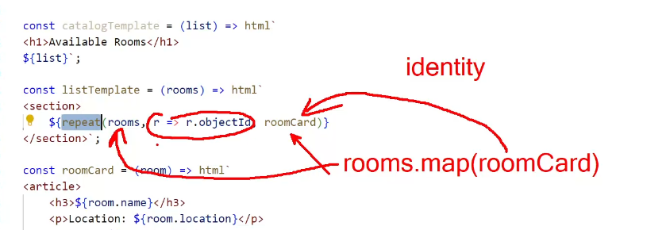
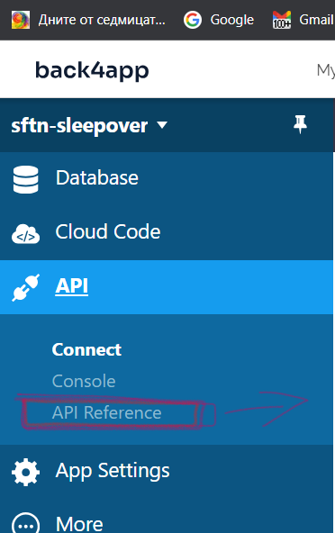
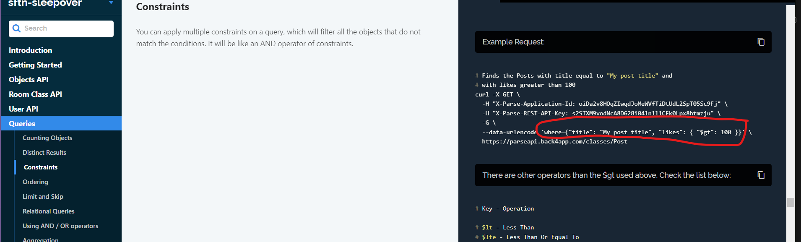
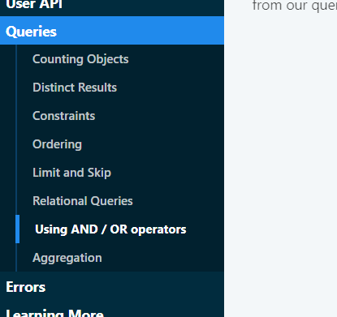
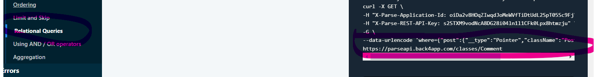
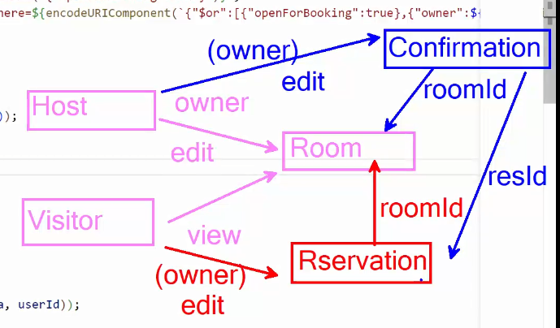
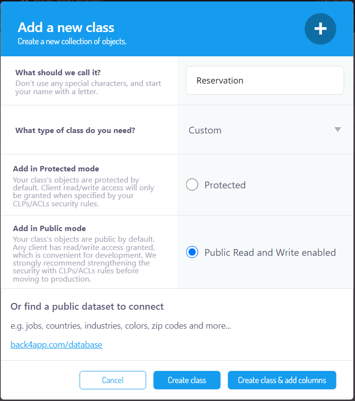
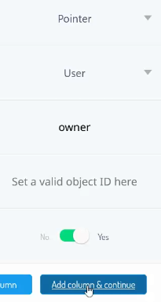
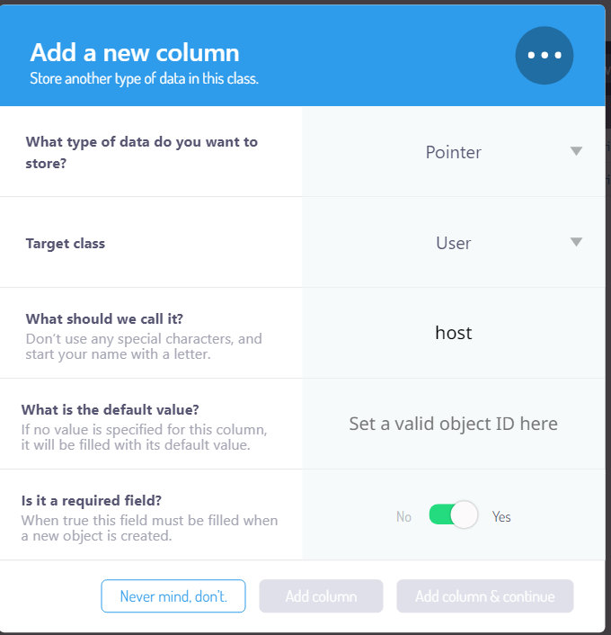
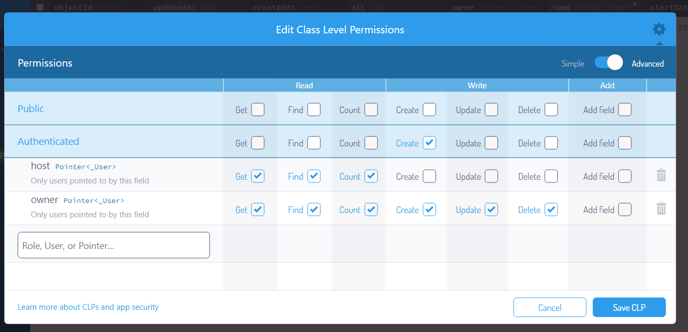

# sftnbooking

## description:
```
using back4app

``` 
#### class level security:


## API Back4APP 
### BASICS requests headers:

```js
headers: {
            'X-Parse-Application-Id': appId,
            'X-Parse-REST-API-Key': restApiKey,
            'X-Parse-JavaScript-Key': apiKey,

        }

        .........

        if (userData) {
        options.headers['X-Parse-Session-Token'] = userData.sessionToken;
    }
```


## -> API reference:

### > https://dashboard.back4app.com/apidocs/oiDa2v8HOqZIwqdJoMeWVfTiDtUdL2SpT05Sc9Fj#Room-custom-class

`example json:`

```JSON
{
  "name": "A string",
  "beds": 1,
  "location": "A string",
  "owner": { "__type": "Pointer", "className": "_User", "objectId": "<THE_REFERENCED_OBJECT_ID>" },
  "openForBooking": true
}
```

`use this:`
>  "owner": { "__type": "Pointer", "className": "_User", "objectId": "<THE_REFERENCED_OBJECT_ID>" },


#### owner:


> `just to remeber how 'repeat' works:`



## filter DataBase request b4app: 

`API Reference > Queries > `




* Constraints



* OR-AND operators



* Relational Queries



`REST API :`
> * **Constraints :**
```JSON
--data-urlencode 'where={"title": "My post title", "likes": { "$gt": 100 }}' \
```

> *  **OR operator :**
```JSON
--data-urlencode 'where={"$or":[{"likes":{"$gt":1000}}, {"title":"My great post"}], "author": {"__type":"Pointer","className":"_User","objectId":"kzunnPFh5i"}}' \
```
> * **Relational Queries :**

```JSON
--data-urlencode 'where={"post":{"__type":"Pointer","className":"Post","objectId":"<OBJECT_ID>"}}' \
```

### `=>`
>  + **`filtering only open for booking rooms :`**
```js
const endpoints = {
    'rooms': (userId) =>
    
    `/classes/Room?where=${encodeURIComponent(`{"$or":[{"openForBooking":true},{"owner":${JSON.stringify(createPointer('_User', userId))}}]}`)}`,

    'roomById': '/classes/Room/'
}
```

## Idea: map of DB relations:



#### reservation class creation:



> ## `type 'Create class & add columns':`




>____
 > `documentation about **include** like **populate** in mongoose`
 >____
>_


+ `use this url --> `
[ https://docs.parseplatform.org/rest/guide/](https://docs.parseplatform.org/rest/guide/)

**Queries > Relational Queries >**
* `You can also do multi level includes using dot notation. If you wanted to include the post for a comment and the post’s author as well you can do:`


```
--data-urlencode 'include=post.author' \
```


> ` added new column to reservation class: `



> `class level permission of Reservation :`

 

