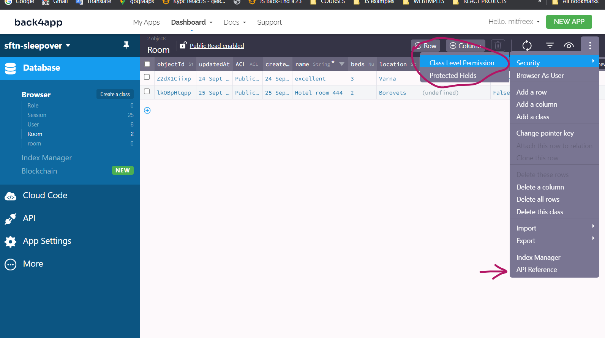
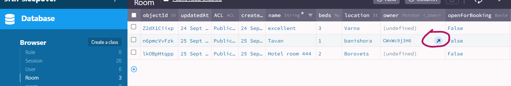

# sftnbooking

## describtion:
```
using back4app

``` 
#### class level security:




## API Back4APP 
### BASICS requests headers:

```js
headers: {
            'X-Parse-Application-Id': appId,
            'X-Parse-REST-API-Key': restApiKey,
            'X-Parse-JavaScript-Key': apiKey,

        }

        .........

        if (userData) {
        options.headers['X-Parse-Session-Token'] = userData.sessionToken;
    }
```


## -> API reference:

### > https://dashboard.back4app.com/apidocs/oiDa2v8HOqZIwqdJoMeWVfTiDtUdL2SpT05Sc9Fj#Room-custom-class

`example json:`

```JSON
{
  "name": "A string",
  "beds": 1,
  "location": "A string",
  "owner": { "__type": "Pointer", "className": "_User", "objectId": "<THE_REFERENCED_OBJECT_ID>" },
  "openForBooking": true
}
```

`use this:`
>  "owner": { "__type": "Pointer", "className": "_User", "objectId": "<THE_REFERENCED_OBJECT_ID>" },


#### owner:


